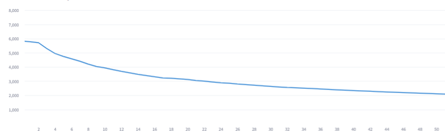
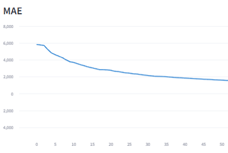
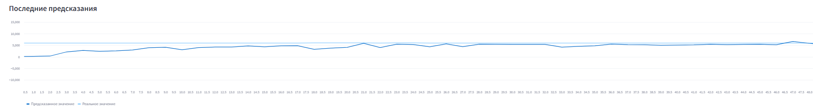

# Лабораторная работа №1

## Набор данных
Используется набор данных https://www.kaggle.com/datasets/shubhambathwal/flight-price-prediction/data , содержащий информацию о авиаперелетах. Набор содержит около 300 000 записей.

## ML задача
Решается задача предсказания стоимости перелета. Используется онлайн-модель `LinearRegression` из библиотеки `river`.

## Визуализация

Приложение использует несколько метрик, а именно `RMSE` и `MAE` , а также график с результатами предсказания модели и реальными данными.

### RMSE

### MAE

### Данные

## Подготовка окружения
Установите зависимости из requirements: `pip install -r requirements.txt`

## Запуск
1. Поднимите контейнер: 
   `docker-compose up -d
    docker-compose up`
2. Запустите по порядку скрипты в отдельных терминалах:
`python src/data_loader_fraud.py
python src/model_training.py 
streamlit run app.py`

## Выключение
Во всех консолях остановите работу скриптов через `Ctrl+C`
Выполните `docker-compose down`